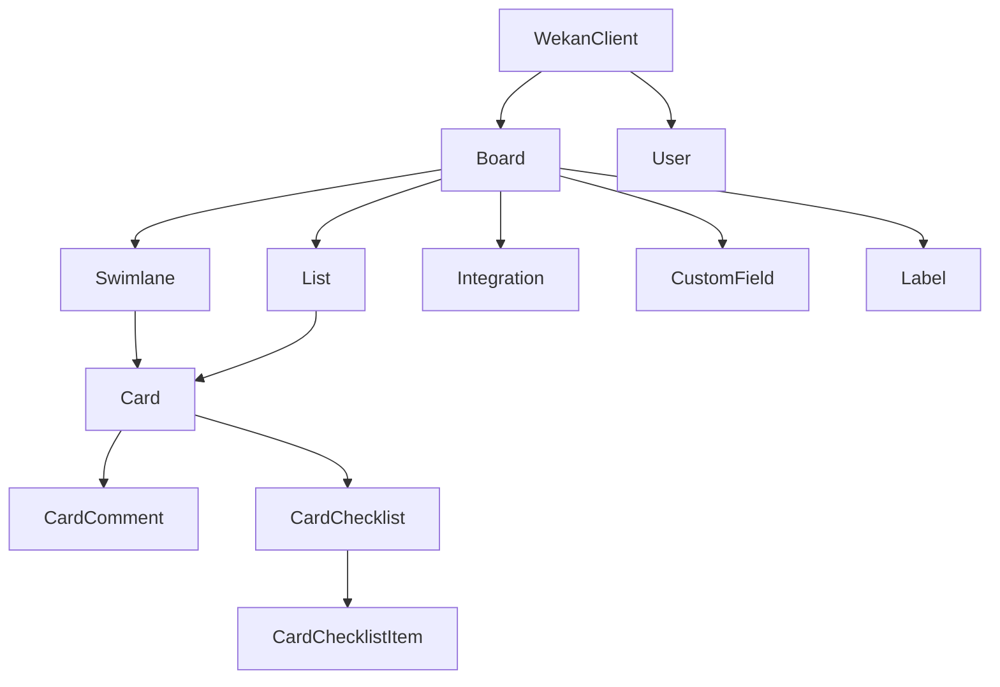

# python-wekan
This is a python client for interacting with the [WeKan®](https://github.com/wekan/wekan) REST-API.
Each WeKan object is represented by a corresponding python object.

For further details about the [WeKan® API](https://wekan.github.io/api/v6.22/#wekan-rest-api) consider the official documentation.

## Installation
```bash
pip install python-wekan
```

## how to use
### Set the credentials
```bash
export WEKAN_USERNAME="USERNAME"
export WEKAN_PASSWORD="PASSWORD" 
```
### Use the module
```python
import os
from wekan import WekanClient


if __name__ == '__main__':
    wekan = WekanClient(base_url='https://your_wekan_instance.com',
                        username=os.getenv('WEKAN_USERNAME'),
                        password=os.getenv('WEKAN_PASSWORD'))
    
    boards = wekan.list_boards()
    for board in boards:
        print(board.title)
```

### Dependencies between the wekan python objects
There are dependencies between the objects.

This visualization shows the dependencies between the various objects.


Example:
If you want to fetch the cards within a list, you need to get the board and the list object first.

## Examples
### Add a new board
```python
import os
from wekan import WekanClient


wekan = WekanClient(base_url='https://your_wekan_instance.com',
                    username=os.getenv('WEKAN_USERNAME'),
                    password=os.getenv('WEKAN_PASSWORD'))

new_board = wekan.add_board(title="My new Board",
                            color="midnight",
                            is_admin=True,
                            is_no_comments=False,
                            is_comment_only=False)
print(new_board.created_at)
```
### Create a new list
```python
import os
from wekan import WekanClient


wekan = WekanClient(base_url='https://your_wekan_instance.com',
                    username=os.getenv('WEKAN_USERNAME'),
                    password=os.getenv('WEKAN_PASSWORD'))

board = wekan.list_boards(regex_filter='My new Board')[0]
board.add_list(title="My first list")
board.add_list(title="My second list")
```
### Create a new card
```python
import os
from wekan import WekanClient


wekan = WekanClient(base_url='https://your_wekan_instance.com',
                    username=os.getenv('WEKAN_USERNAME'),
                    password=os.getenv('WEKAN_PASSWORD'))

board = wekan.list_boards(regex_filter='My new Board')[0]
wekan_list = board.list_lists(regex_filter="My first list")[0]
swimlane = board.list_swimlanes()[0]
wekan_list.add_card(title="My first card",
                    swimlane=swimlane,
                    description="My first description")
```
### Move card between lists
```python
import os
from wekan import WekanClient


wekan = WekanClient(base_url='https://your_wekan_instance.com',
                    username=os.getenv('WEKAN_USERNAME'),
                    password=os.getenv('WEKAN_PASSWORD'))

board = wekan.list_boards(regex_filter='My new Board')[0]
src_list = board.list_lists(regex_filter="My first list")[0]
dst_list = board.list_lists(regex_filter="My second list")[0]
card = src_list.list_cards(regex_filter="My first card")[0]
card.edit(new_list=dst_list)
```

### Create a new swimlane
```python
import os
from wekan import WekanClient


wekan = WekanClient(base_url='https://your_wekan_instance.com',
                    username=os.getenv('WEKAN_USERNAME'),
                    password=os.getenv('WEKAN_PASSWORD'))

board = wekan.list_boards(regex_filter='My new Board')[0]
board.add_swimlane(title="My first swimlane")
```

## Development
### Generate requirements
```bash
pipenv requirements > requirements.txt
pipenv requirements --dev-only > requirements_dev.txt
 ```

## credits
This project is build on base of [py-trello](https://github.com/sarumont/py-trello).
Some methods and design structures were adopted 1:1.

