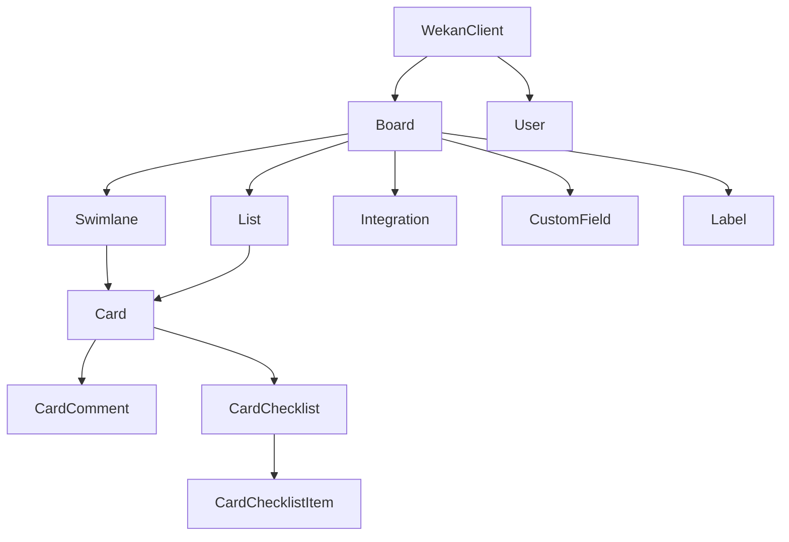

# python-wekan
This is a python client for interacting with the [WeKan®](https://github.com/wekan/wekan) REST-API.
Each WeKan object is represented by a corresponding python object.

For further details about the [WeKan® API](https://wekan.github.io/api) consider the official documentation.

## Installation
The project assumes that you are using a [currently-supported](https://devguide.python.org/versions/) version of Python, which is 3.9+ at the time of writing.

### From OS Packaging
[](https://repology.org/project/python:wekan/versions)

### Via pip
```bash
# Install library only
pip install python-wekan

# Install with CLI support
pip install python-wekan[cli]
```

## How to use
### Set the credentials
```bash
export WEKAN_USERNAME="USERNAME"
export WEKAN_PASSWORD="PASSWORD" # pragma: allowlist secret
```
### Use the module
```python
import os
from wekan import WekanClient


if __name__ == '__main__':
    wekan = WekanClient(
        base_url='https://your_wekan_instance.com',
        username=os.getenv('WEKAN_USERNAME'),
        password=os.getenv('WEKAN_PASSWORD'))

    boards = wekan.list_boards()
    for board in boards:
        print(board.title)
```

### Dependencies between the wekan python objects
There are dependencies between objects.

This visualisation shows the dependencies between different objects.


Example:
If you want to fetch the cards within a list, you need to get the board and the list object first.

## Examples
### Add a new board
```python
import os
from wekan import WekanClient


wekan = WekanClient(
    base_url='https://your_wekan_instance.com',
    username=os.getenv('WEKAN_USERNAME'),
    password=os.getenv('WEKAN_PASSWORD'))

new_board = wekan.add_board(
    title="My new Board",
    color="midnight",
    is_admin=True,
    is_no_comments=False,
    is_comment_only=False)
print(new_board.created_at)
```
### Create a new list
```python
import os
from wekan import WekanClient


wekan = WekanClient(
    base_url='https://your_wekan_instance.com',
    username=os.getenv('WEKAN_USERNAME'),
    password=os.getenv('WEKAN_PASSWORD'))

board = wekan.list_boards(regex_filter='My new Board')[0]
board.add_list(title="My first list")
board.add_list(title="My second list")
```
### Create a new card
```python
import os
from wekan import WekanClient


wekan = WekanClient(
    base_url='https://your_wekan_instance.com',
    username=os.getenv('WEKAN_USERNAME'),
    password=os.getenv('WEKAN_PASSWORD'))

board = wekan.list_boards(regex_filter='My new Board')[0]
wekan_list = board.list_lists(regex_filter="My first list")[0]
swimlane = board.list_swimlanes()[0]
wekan_list.add_card(
    title="My first card",
    swimlane=swimlane,
    description="My first description")
```
### Move card between lists
```python
import os
from wekan import WekanClient


wekan = WekanClient(
    base_url='https://your_wekan_instance.com',
    username=os.getenv('WEKAN_USERNAME'),
    password=os.getenv('WEKAN_PASSWORD'))

board = wekan.list_boards(regex_filter='My new Board')[0]
src_list = board.list_lists(regex_filter="My first list")[0]
dst_list = board.list_lists(regex_filter="My second list")[0]
card = src_list.list_cards(regex_filter="My first card")[0]
card.edit(new_list=dst_list)
```

### Create a new swimlane
```python
import os
from wekan import WekanClient


wekan = WekanClient(
    base_url='https://your_wekan_instance.com',
    username=os.getenv('WEKAN_USERNAME'),
    password=os.getenv('WEKAN_PASSWORD'))

board = wekan.list_boards(regex_filter='My new Board')[0]
board.add_swimlane(title="My first swimlane")
```

## Command Line Interface

The python-wekan library includes a comprehensive CLI with modern features for managing WeKan boards from the command line.

### Installation
```bash
pip install python-wekan[cli]
```

### Quick Start
```bash
# Initialize configuration
wekan config init https://your-wekan-server.com username password

# Check connection status
wekan status

# Start interactive navigation shell (recommended!)
wekan navigate
```

### Interactive Navigation Shell
The CLI features a powerful **filesystem-like navigation** interface that lets you browse and manage your WeKan boards intuitively:

```bash
# Start the navigation shell
wekan navigate

# Navigate through your boards, lists, and cards like directories
wekan> ls                    # List all boards
wekan> cd "My Project"       # Enter a board
wekan:/My Project> ls        # List board contents (lists, swimlanes)
wekan:/My Project> cd Todo   # Enter a list
wekan:/My Project/Todo> ls   # List cards in the list
wekan:/My Project/Todo> cd 1 # Enter a card by index or ID
wekan:/My Project/Todo/1> edit # Edit card properties

# Navigation commands
pwd                          # Show current path
cd ..                        # Go up one level
cd /                         # Go to root (all boards)
history                      # Show command history
help                         # Show available commands
exit                         # Exit navigation shell
```

### Standard Commands
Beyond the interactive shell, these commands are available:

#### Board Management
```bash
# List boards
wekan boards list

# Show board details
wekan boards show <board-id>

# Create a new board
wekan boards create "My Project Board" --description "Project management board"
```

#### Authentication & Configuration
```bash
# Authentication
wekan auth login             # Login with credentials
wekan auth whoami           # Show current user
wekan auth logout           # Clear stored credentials

# Configuration management
wekan config init <url> <username> <password>  # Initialize configuration
wekan config show                               # Show current configuration
wekan config set <key> <value>                 # Set configuration value
```

#### Utility Commands
```bash
wekan status                # Show connection status and server info
wekan version              # Show CLI version information
```

### Configuration
The CLI supports multiple configuration methods:

#### Configuration File (`.wekan`)
The CLI automatically searches for `.wekan` configuration files in:
- Current directory
- Parent directories (up to home directory)
- Home directory (`~/.wekan`)

Example `.wekan` file:
```ini
[default]
base_url = https://your-wekan-server.com
username = your-username
password = your-password
```

#### Environment Variables
```bash
export WEKAN_BASE_URL=https://your-wekan-server.com
export WEKAN_USERNAME=your-username
export WEKAN_PASSWORD=your-password
```

### Features
- **Modern CLI Framework**: Built with typer and rich for beautiful output
- **Interactive Navigation**: Filesystem-like cd/ls/pwd interface
- **Command History**: Built-in command history and tab completion
- **Hierarchical Context**: Navigate through boards → lists → cards seamlessly
- **Card Editing**: Comprehensive card editing interface with date, member, label support
- **Configuration Management**: Flexible configuration via files or environment variables
- **Error Handling**: Improved error handling and user-friendly messages

## Development
### Generate requirements
```bash
pipenv requirements > requirements.txt
pipenv requirements --dev-only > requirements_dev.txt
 ```

## credits
This project is based on [py-trello](https://github.com/sarumont/py-trello).
Some methods and design structures have been adopted 1:1.
